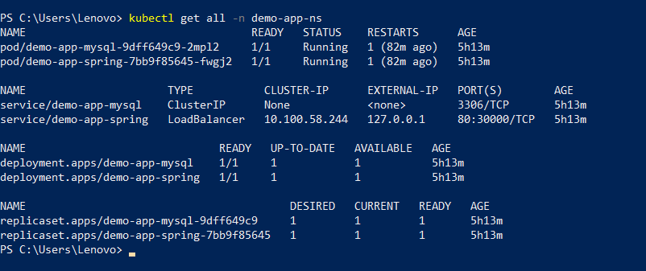
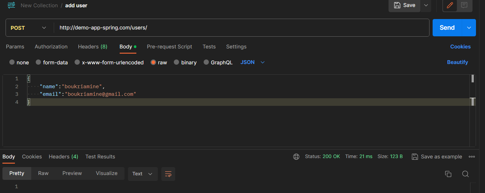
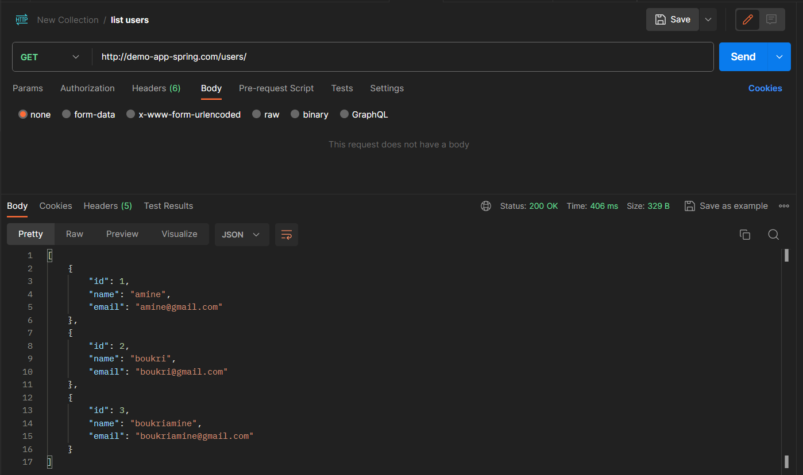

# Terraform Demo: Deploy Spring Boot Application with MySQL DB on Kubernetes

## 📝 Table of Contents
This project demonstrates how to use Terraform to deploy a Spring Boot application with a MySQL database on Kubernetes.

- [Prerequisites](#prerequisites)
- [Create Your Application](#create-your-application)
- [Dockerize the Application](#dockerize-the-application)
- [Deploy MySql on Kubernetes](#deploy-mysql-on-kubernetes)
- [Application deployment](#application-deployment)
- [Create the main Terraform file](#create-the-main-terraform-file)
- [Add Ingress for Custom Domain](#add-ingress)
- [Deploy your application](#deploy-your-application)
- [Test your application](#test-your-application)
- [Clean Up](#clean-up)
- [Conclusion](#conclusion)
---
<a name="prerequisites"></a>
## 📚 Prerequisites

Ensure you have the following tools installed. If not, follow the provided links for installation guides:

- [Terraform](https://www.terraform.io/downloads.html)
    - To check if Terraform is installed, run `terraform version` in the terminal.

- [Docker](https://www.docker.com/get-started)
    - To check if Docker is installed, run `docker --version` in the terminal.

- [Minikube](https://minikube.sigs.k8s.io/docs/start/)
    - To check if Minikube is installed, run `minikube version` in the terminal.

- [kubectl](https://kubernetes.io/docs/tasks/tools/install-kubectl/)
    - To check if kubectl is installed, run `kubectl version --client` in the terminal.

---
<a name="create-your-application"></a>
## Part I - Create Your Application

To begin, you need a Spring Boot application. You can either create a new one using your preferred IDE or use
the [start.spring.io](https://start.spring.io/) website to generate a new project. Ensure to include the following
dependencies:

- spring-boot-starter-data-jpa
- spring-boot-starter-web
- mysql-connector-java
- lombok

### Option 1: Create a New Spring Boot Application

1. Open your IDE (Integrated Development Environment).

2. Create a new Spring Boot project.

3. Add the required dependencies mentioned above.

4. Develop your application logic.

### Option 2: Use Existing Repository

Alternatively, you can clone the following repository:

```bash
git clone https://github.com/boukriAMINE07/k8s-terraform-spring-mysql-demo.git
```

After completing the creation of your application, ensure that the `application.yml` file in ressources folder includes
the following configuration:

##### 📄 application.yml

```yaml
server:
  port: 8080
spring:
  datasource:
    url: jdbc:mysql://${DB_SERVER}:${DB_PORT:3306}/${DB_NAME}
    username: ${DB_USERNAME}
    password: ${DB_PASSWORD}
  jpa:
    hibernate:
      ddl-auto: update
    properties:
      hibernate:
        dialect: org.hibernate.dialect.MySQL5Dialect
```
> [!NOTE]  
> In this setup, Kubernetes will be employed to substitute the values for `DB_SERVER`, `DB_USERNAME`, `DB_NAME`,
and `DB_PASSWORD`.

---
<a name="dockerize-the-application"></a>
## Part II - Dockerize the Application

In this section, you'll containerize your Spring Boot application using Docker. Follow these steps to create a Docker
image and push it to Docker Hub.

#### 📄 Dockerfile

1. In the root directory, create a new file and name it `Dockerfile` (without extension).
2. Add the following content to the `Dockerfile`:

```Dockerfile
FROM dvmarques/openjdk-17-jdk-alpine-with-timezone
ENV PORT 8080
EXPOSE 8080
COPY target/*.jar /opt/app.jar
ENTRYPOINT exec java $JAVA_OPTS -jar app.jar
```

### Build and Push Docker Image

In the root directory, build the Docker image:

```bash
# Navigate to the root directory of your project before running the following commands.
# Make sure to replace <YOUR_DOCKER_USERNAME> with your actual Docker Hub username.

$ mvn clean package -DskipTests
$ docker build -t <YOUR_DOCKER_USERNAME>/k8s-terraform-spring-mysql .
```

Push the image to Docker Hub:

```bash
$ docker push <YOUR_DOCKER_USERNAME>/k8s-terraform-spring-mysql
```

---
<a name="deploy-mysql-on-kubernetes"></a>
## Part III - Deploy MySql on Kubernetes

To deploy MySql, follow these steps:

1. Create a folder named `terraform` in your app directory.
2. Inside the `terraform` folder, add the following essential files:

#### 📄 config-map.tf

- config-map.tf: ConfigMap, utilized by both the MySql container and the app container to share common configurations.

```terraform
resource "kubernetes_config_map" "demo_app_cm" {
  metadata {
    name = "mysql-config-map"
    namespace = kubernetes_namespace.demo_app_ns.metadata.0.name
  }

  data = {
    mysql-server = "demo-app-mysql"
    mysql-database-name = "demoDb"
    mysql-user-username = "myUser"
  }
}
```

#### 📄 secrets.tf

- secrets.tf: Secret, to save sensitive data like passwords for databases.

```terraform
#Create a secret for mysql
resource "kubernetes_secret" "demo_app_secret" {
  metadata {
    name = "mysql-pass"
    namespace = kubernetes_namespace.demo_app_ns.metadata.0.name
  }

  data = {
    mysql-root-password = "cm9vdHBhc3N3b3Jk"
    mysql-user-password = "dXNlcnBhc3N3b3Jk"
  }
}
````

>[!TIP]  
> The values for `mysql-root-password` and `mysql-user-password` are base64 encoded. You can use the following command to encode your passwords:
> ```bash
> $ echo -n 'your-password' | base64
> ```

#### 📄 mysql.tf

- mysql.tf: MySql deployment and service.

```terraform
resource "kubernetes_service" "demo_app_mysql_service" {
  metadata {
    name = "demo-app-mysql"
    namespace = kubernetes_namespace.demo_app_ns.metadata.0.name
    labels = {
      app = "demo-app"
    }
  }

  spec {
    selector = {
      app = kubernetes_deployment.demo_app_mysql_deployment.metadata.0.labels.app
      tier = "mysql"
    }

    port {
      port = 3306
    }

    cluster_ip = "None"
  }
}

resource "kubernetes_persistent_volume_claim" "demo_app_pvc" {
  metadata {
    name = "mysql-pvc"
    namespace = kubernetes_namespace.demo_app_ns.metadata.0.name
    labels = {
      app = "demo-app"
    }
  }

  spec {
    access_modes = [
      "ReadWriteOnce"]

    resources {
      requests = {
        storage = "1Gi"
      }
    }
  }
}

resource "kubernetes_deployment" "demo_app_mysql_deployment" {
  metadata {
    name = "demo-app-mysql"
    namespace = kubernetes_namespace.demo_app_ns.metadata.0.name
    labels = {
      app = "demo-app"
    }
  }

  spec {
    selector {
      match_labels = {
        app = "demo-app"
        tier = "mysql"
      }
    }

    strategy {
      type = "Recreate"
    }

    template {
      metadata {
        labels = {
          app = "demo-app"
          tier = "mysql"
        }
      }

      spec {
        container {
          image = "mysql:5.6"
          name = "mysql"

          env {
            name = "MYSQL_DATABASE"
            value_from {
              config_map_key_ref {
                key = "mysql-database-name"
                name = kubernetes_config_map.demo_app_cm.metadata.0.name

              }
            }
          }
        }

        env {
          name = "MYSQL_ROOT_PASSWORD"
          value_from {
            secret_key_ref {
              key = "mysql-root-password"
              name = kubernetes_secret.demo_app_secret.metadata.0.name

            }
          }
        }

        env {
          name = "MYSQL_USER"
          value_from {
            config_map_key_ref {
              key = "mysql-user-username"
              name = kubernetes_config_map.demo_app_cm.metadata.0.name

            }
          }
        }

        env {
          name = "MYSQL_PASSWORD"
          value_from {
            secret_key_ref {
              key = "mysql-user-password"
              name = kubernetes_secret.demo_app_secret.metadata.0.name

            }
          }
        }

        liveness_probe {
          tcp_socket {
            port = 3306
          }
        }

        port {
          name = "mysql"
          container_port = 3306
        }

        volume_mount {
          name = "mysql-persistent-storage"
          mount_path = "/var/lib/mysql"
        }
      }

      volume {
        name = "mysql-persistent-storage"
        persistent_volume_claim {
          claim_name = kubernetes_persistent_volume_claim.demo_app_pvc.metadata.0.name
        }
      }
    }
  }
}
```

> [!TIP]
> **Deployment:** to checkout the MySql image and run it as a Pod/Container.
> 
> **PersistentVolumeClaim:** to manage storage.
> 
> **Service:** to expose the MySql container inside Kubernetes cluster.
---
<a name="application-deployment"></a>
## Part IV - Application deployment

To deploy the application, follow these steps:

1 — Create Docker Hub connection secret To pull the application image, you need to connect to the Docker Hub.

#### 📄 secrets.tf

in the secret file `secrets.tf`, add the following code:

```terraform
# Create a secret for docker registry
resource "kubernetes_secret" "docker_secret" {
  metadata {
    name = "docker-cfg"
    namespace = kubernetes_namespace.demo_app_ns.metadata.0.name
  }

  data = {
    ".dockerconfigjson" = jsonencode({
      auths = {
        "${var.registry_server}" = {
          auth = "${base64encode("${var.registry_username}:${var.registry_password}")}"
        }
      }
    })
  }

  type = "kubernetes.io/dockerconfigjson"
}
```

> [!NOTE]
> values of `registry_server`, `registry_username` and `registry_password` are defined in `variables.tf` file.

#### 📄 variables.tf

create a file `variables.tf` and add the following code:

```terraform
variable "registry_server" {
  type = string
  default = "https://hub.docker.com/"
}

variable "registry_username" {
  type = string
  default = "<YOUR_DOCKER_HUB_USERNAME>"
}

variable "registry_password" {
  type = string
  sensitive = true
}
```

> [!NOTE]       
> registry_server: is the Docker Hub registry.
> 
> registry_username: is your Docker Hub username.
> 
> registry_password: is your Docker Hub password.

2 — Create the application deployment and service resources .

To deploy the application, create new file `application.tf` in the `terraform` folder and add the following code:

#### 📄 application.tf

```terraform
resource "kubernetes_service" "demo_app_spring_service" {
  metadata {
    name = "demo-app-spring"
    namespace = kubernetes_namespace.demo_app_ns.metadata.0.name
    labels = {
      app = "demo-app-spring"
    }
  }

  spec {
    type = "LoadBalancer"
    selector = {
      app = "demo-app-spring"
    }

    port {
      name = "http"
      protocol = "TCP"
      port = 80
      target_port = 8080
      node_port = 30000
    }
  }
}


resource "kubernetes_deployment" "demo_app_spring_deployment" {
  metadata {
    name = "demo-app-spring"
    namespace = kubernetes_namespace.demo_app_ns.metadata.0.name
    labels = {
      app = "demo-app-spring"
    }
  }


  spec {
    selector {
      match_labels = {
        app = "demo-app-spring"
      }
    }

    template {
      metadata {
        labels = {
          app = "demo-app-spring"
        }
      }

      spec {
        container {
          name = "demo-app-spring"
          image = "<YOUR_DOCKER_HUB_USERNAME>/k8s-terraform-spring-mysql:latest"
          image_pull_policy = "IfNotPresent"

          port {
            name = "http"
            container_port = 8080
          }

          resources {
            limits = {
              cpu = 0.2
              memory = "200Mi"
            }
          }

          env {
            name = "DB_PASSWORD"
            value_from {
              secret_key_ref {
                key = "mysql-user-password"
                name = kubernetes_secret.demo_app_secret.metadata.0.name

              }
            }
          }


          env {
            name = "DB_USERNAME"
            value_from {
              config_map_key_ref  {
                key  = "mysql-user-username"
                name = kubernetes_config_map.demo_app_cm.metadata.0.name

              }
            }
          }

          env {
            name = "DB_SERVER"
            value_from {
              config_map_key_ref {
                key = "mysql-server"
                name = kubernetes_config_map.demo_app_cm.metadata.0.name
              }
            }
          }

          env {
            name = "DB_NAME"
            value_from {
              config_map_key_ref {
                key = "mysql-database-name"
                name = kubernetes_config_map.demo_app_cm.metadata.0.name
              }
            }

          }

          env {
            name = "MYSQL_USER"
            value_from {
              config_map_key_ref {
                key = "mysql-user-username"
                name = kubernetes_config_map.demo_app_cm.metadata.0.name

              }
            }
          }
        }
        image_pull_secrets {
          name = kubernetes_secret.demo_app_secret.metadata.0.name
        }
      }
    }
  }
}
```
<a name="create-the-main-terraform-file"></a>
## Part V - Create the main Terraform file

To create the main Terraform file, follow these steps:
1 — Create the main Terraform file in the `terraform` folder and name it `main.tf`.

#### 📄 main.tf

```terraform
terraform {
  required_providers {
    kubernetes = {
      source = "hashicorp/kubernetes"
      version = ">= 2.0.0"
    }
  }
}

provider "kubernetes" {
  config_path = "~/.kube/config"
}

resource "kubernetes_namespace" "demo_app_ns" {
  metadata {
    name = "demo-app-ns"
  }
}
```

> [!NOTE]     
> The main.tf file, is the entry point for Terraform. It defines the required providers and the Kubernetes namespace.
---


<a name="add-ingress"></a>
## Part VI - Add Ingress for Custom Domain
Before deploying your application, let's set up Ingress to enable access through a custom domain.

1. Open your `/etc/hosts` file and add the following entry to map the domain to `127.0.0.1`:
    ```plaintext
    127.0.0.1  demo-app-spring.com
    ```

2. Ensure that your `application.tf` contains the Ingress configuration for the custom domain. Here's an example configuration you can add to the existing file:

    ```hcl
    resource "kubernetes_ingress_v1" "demo_app_ingress" {
      metadata {
        name      = "demo-app-ingress"
        namespace = kubernetes_namespace.demo_app_ns.metadata.0.name
      }
      spec {
        rule {
          host = "demo-app-spring.com"
          http {
            path {
              path     = "/users/*"
              path_type = "Prefix"
              backend {
                service {
                  name =  kubernetes_service.demo_app_spring_service.metadata.0.name
                  port {
                    number = 80
                  }
                }
              }
            }
          }
        }
      }
    }
    ```

> [!NOTE]  
> Replace `/users/` with the appropriate endpoint for your application.

3. Run the following command to enable Ingress on Minikube (if not already done):
    ```bash
    $ minikube addons enable ingress
    ```

4. Start the Minikube tunnel to expose services:
    ```bash
    $ minikube tunnel
    ```

> [!WARNING]  
> Make sure to keep the Minikube tunnel running while testing your application.

---
<a name="deploy-your-application"></a>
## Part VII - Deploy Your Application
In the main Terraform directory, run the following command to initialize your working directory containing the Terraform configurations:

1. Initialize the Terraform working directory:
    ```bash 
    $ terraform init
    ```
> [!NOTE]  
> This will initialize the Terraform configuration and download any necessary plugins.

2. Run the following command to refresh and preview all changes that Terraform plans to make to your infrastructure:
    ```bash
    $ terraform plan -var 'registry_password=<YOUR_DOCKER_HUB_PASSWORD>'
    ```
> [!WARNING]  
> Don't forget to replace `<YOUR_DOCKER_HUB_PASSWORD>` with your Docker Hub password.

3. Run the following command to apply the changes:
    ```bash
    $ terraform apply -var 'registry_password=<YOUR_DOCKER_HUB_PASSWORD>' -auto-approve
    ```
> [!WARNING]  
> Don't forget to replace `<YOUR_DOCKER_HUB_PASSWORD>` with your Docker Hub password.
---

<a name="test-your-application"></a>
## Part VIII - Test Your Application
1. Make sure that all the pods are running, and the app service is exposed as a load balancer:
    ```bash
    $ kubectl get all -n demo-app-ns
    ```

   

2. Test your application directly with the custom domain:
    ```bash
    $ curl http://demo-app-spring.com/users/
    ```
> [!NOTE]  
> Replace `/users/` with the appropriate endpoint for your application.

   

   

---


<a name="clean-up"></a>
## Part IX - Clean Up
To clean up the resources created by Terraform, run the following command:
> [!CAUTION]  
> This will destroy all the resources created by Terraform.
```bash
$ terraform destroy -var 'registry_password=<YOUR_DOCKER_HUB_PASSWORD>' -auto-approve
```
> [!WARNING]  
> Don't forget to replace `<YOUR_DOCKER_HUB_PASSWORD>` with your Docker Hub password.
## Conclusion
- Congratulations 🎉 Thank you for reading my article !. 
- You have successfully deployed a Spring Boot application with MySQL database on Kubernetes using Terraform.
- I hope you enjoyed it and found it helpful. If you have any questions, please feel free to reach out to me on [LinkedIn](https://www.linkedin.com/in/amine-boukri/).
---
> [!IMPORTANT]   
> This article is created by **[Amine Boukri](https://www.linkedin.com/in/amine-boukri/)**.
